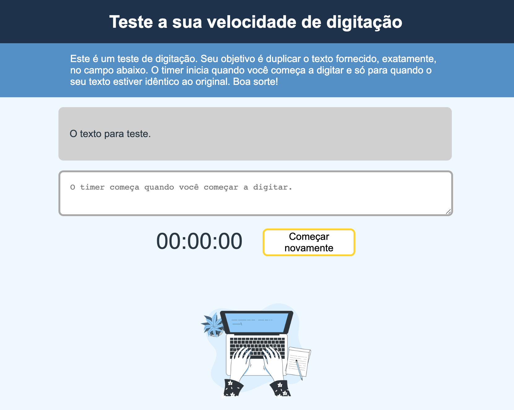

# Teste de velocidade de digitação
Repositorio destinado a um projeto do curso JavaScript: Formação Básica do LinkeIn Learning. Com cronômetro, verificador de ortografia, botão de recomeçar, e responsividade.

## Feito com
- HTML
- CSS
- JavaScript

